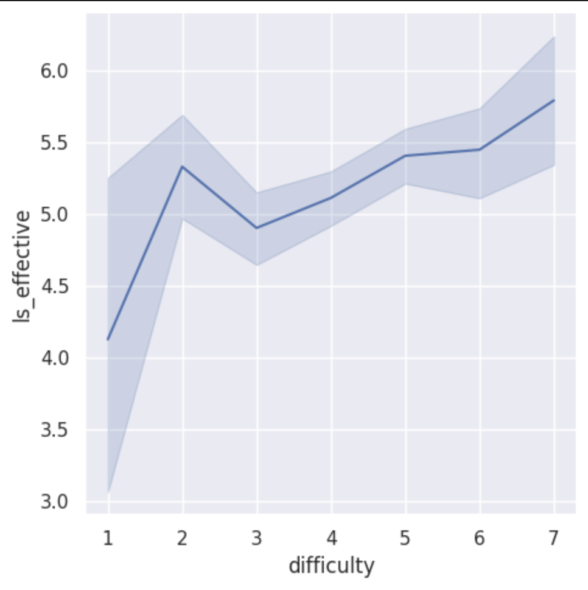
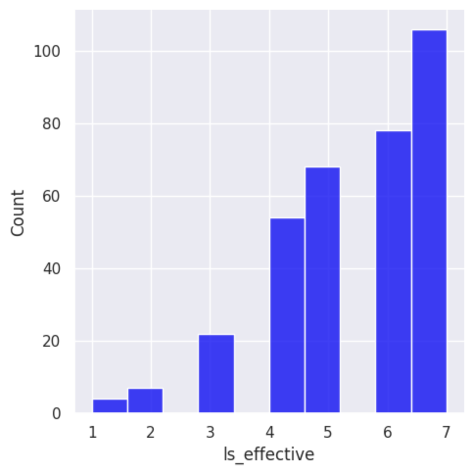
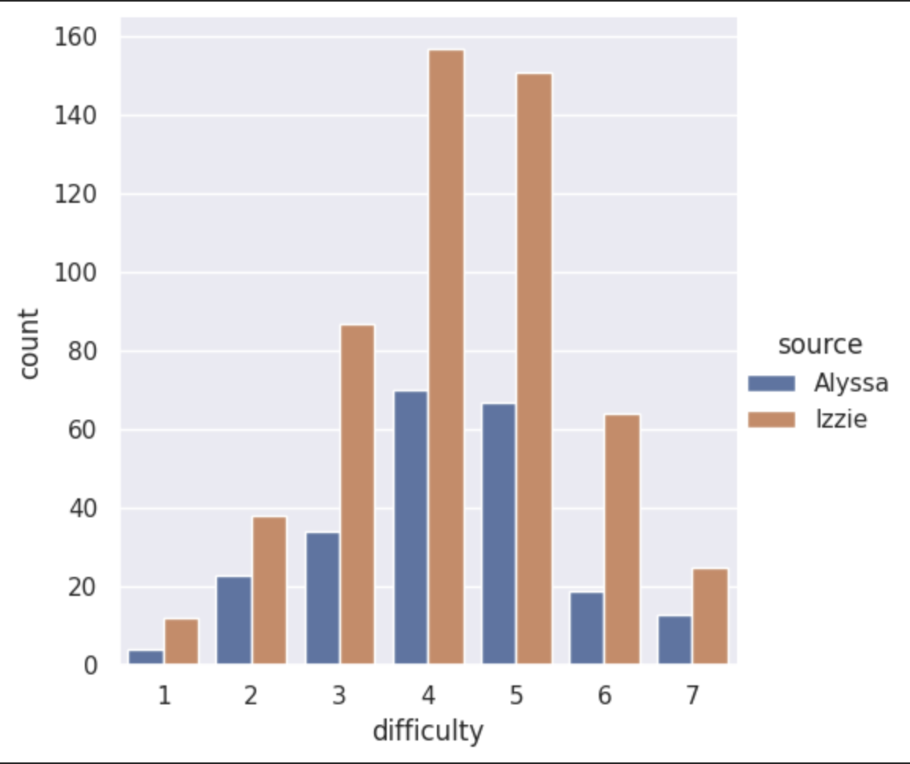

---
# Do not edit the text between these lines!
layout: default
---

# COMP110 Project Site

Welcome to Medha and Tharini's project site for COMP110. We are excited to shared with you the results and analysis of our project, and our recommendations for future improvement. We hope you find our project informative, and look forward to hearing your thoughts and questions! Thank you for visiting our site!

---

## Project Overview

This project explores survey data from students across all the COMP110 sections during the Spring 2026 semester. Our initial explorations ideas were:
"""1. Comparing the results across the quizz scores of multiple classes and sections."""
"""2. Understanding the effectioveness of updated slides/content from classes in studying efficiency.""" 
"""3. Determining whether releasing practice for quizzes earlier would improve scores."""

Based on the data available from the survey, we determined that the idea we would have the most data to support would be: "The instructors should continuously update slides/documents from classe with the covered materials because it will help with revising and better understanding for students."

Understanding and exploring the idea would provide important insights into the COMP110 learning process because it is a class that is heavily dependent on aspects such as memory diagrams that are difficult to produce on your own, and also take significant amounts of time in class. This improvment, if shown to have a positive impact, would allow students to better be able to revise and improve their understanding of any material they didn't fully grasp during the lecture. 

The data sets we used for this analysis were:
1. ls_effectiveness
2. difficulty 

Below, we will evaluate the results of the subsequent analysis. 
<!-- This is a comment. Below, you'll see code for inserting an image. To make this image appear, update <custom-path>. To add an image, save it inside the imgs folder of this repository. -->
---

---

---

---
## This is a small header

This is basic paragraph text.